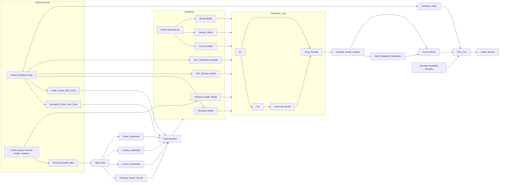

# Welcome to the PSS Allocations repo
Here, you will find a collection of source code and files that are useful for colleagues continuing the analytical work involved in the PSS Physical Health Modelling work and the resultant Variations Tool.

## Handover
Due to the timescales associated with the NHSE reorganisation, this document had been prepared to enable as smooth a handover as possible to enable business continuity and effective knowledge management with respect to the PSS Physical Health Variations Tool.

The Variations Tool is a complicated document, bringing together several separate programmes of modelling work and presenting the results with a fair amount of additional analysis. It has been through quite a few iterations (currently v14) and has the added complexity of requiring three different kinds of updates in the near future (during Q1, 2024-25).
In this document, I outline pre-New-NHSE roles and responsibilities – with named owners where possible – and provide information on how the model is constructed up to the point of handover. Some imminent changes will be required, and to the extent that I can I have provided guidance on next steps. 

The author of this document is happy to be contacted following transition to the new role.

| Name           | Role          | Contact      | Comment      |
| -------------  | ------------- | ------------ | ------------- |
| Ashley Dickson | Head of Payment Development | Ashley.Dickson@nhs.net | Previously, Senior Analytical Lead. Outgoing analytical lead.      |
| Donald Franklin | New Role tbc | Donald.Franklin@nhs.net | Former SRO |
| Sam Leat | Analytical Office | Samuel.Leat@nhs.net| Incoming Analyst |
| Ioannis Andreadis | Senior Analyst | Ioannis.Andreadis@nhs.net | Incoming Analytical Lead |
| Heather Ross | Senior Analytical Lead | Heather.Ross1@nhs.net | Incoming SRO |

It is understood at this stage that Sam and Ioannis will be taking over the operational dat-to-day management of the tool and its dissemination.

## Flow chart / graph for Variations Tool data sources
This flowchart describes the totality of data sources and modelling that are dependencies for the Variations Tool as it currently stands. It is provided as a very high-level overview of the steps involved from inception to delivery, and will be updated in the coming days to ensure that steps and repo files are named and numbered in accordance with one another.

## Purpose and Audience
This work (at the time of publication) has three primary purposes, described below. These are the success criteria against which to assess the outputs. It Should be noted that there are several things which this modelling work is not intended to be (and hence is not a measure of its success), namely, it is not intended as a model of Provider or Site resource allocation, neither descriptively or normatively. This is a separate piece of work that regional and ICB colleagues will need to undertake using local intelligence, geography, transportation links, etc., in order to design the most appropriate way of organisation a population-based allocation of resources.

The positive purpose of the Tool is to make clear the way in which a particular ICB deviates from its comparators when considering its overall distance from target such that system and regional colleagues can make evidence-based decisions on what investigations to prosecutre next, and what actions, if any, are to be taken regarding commissioning of services.

## Data Sources
The majority of the activity and spend data for both modelling and DtM analysis come from PLCM and CCMDS. 

PLCM consists of the PLD, Drugs and Devices tables, while CCMDS is cut by ACC and NCC respectively. 

Directions to these tables are:

- PLCM:
  - PLD: [NHSE_Reporting_Regional].[dbo].[vw_DS_Snap_PLD]
  - Drugs: [NHSE_Reporting_Regional].[dbo].[vw_DS_Snap_Drugs]
  - Devices:[NHSE_Reporting_Regional].[dbo].[vw_DS_Snap_Devices]
- CCMDS: [NHSE_SUSPlus_Live].[dbo].[tbl_Data_PbR_CC]

It should be noted that these tables are the preferred tables to use for PLCM; we previously used the relevant [DWS_SLAM].[DWS_Reg].[tbl_Data_*] tables, and these are referred to the in 'PLCM_Query' script given in the repo. This will need updating.

A collection of semi-raw data has been curated and dropped onto the data warehouse for colleagues to interact with programmatically, if they prefer. The locations are given below.
- [NHSE_Sandbox_DC].[dbo].[varTool_ACC_Activity_Model$]
- [NHSE_Sandbox_DC].[dbo].[varTool_Benchmark_Peers$]
- [NHSE_Sandbox_DC].[dbo].[varTool_Model_Need_Indices$]
- [NHSE_Sandbox_DC].[dbo].[varTool_NCC_Activity_Model$]
- [NHSE_Sandbox_DC].[dbo].[varTool_Spend_Model$]

## Updating the tool
Updating the tool with new figures is actually a fairly simple process, but it can be a little laborious. The supplmentary handover note from Matt will aid in understanding, but tracing the formulae back from all the charts leads you the following tabs:
- **BaselineExpenditure**
- **Disaggregation**
- **Model_Outputs**

'Baseline expenditure' is self-explanatory. It will beed to be updated with 2023-24 actual expenditure when it is available. This will come from PLCM.

'Disaggregation' provides the top-level and service-level breakdown of spend and the crucial additional facts of unique patient counts and population statistics. There are additional columns to the right of the table (as discussed) for Critical Care, so as not to pollute the totals with the additional CWRU information. CWRU calculations can be found in several of the SQL script in this repo.

(NB: The update will require due attention paid to PLCM/ACM issues as discussed below.)

Model outputs shouldn't need updating since they already pertain to the correct financial year (and currently the totals are whole-year estimates.)

## Data Quality Issues
There is a non-trivial issue with the qulity of the data being used in this analysis. The decomposition of spend per head of population into access rates and intensity are meaningful only to the extent that the unique patient numbers are correct; that is, if there are too few unique patients recorded in PLCM, then it will look like the intensity is very high and that the access if very low.

In the tool, there is a tab in Section 5 relating to PLCM coverage as compared to ACM. This shows which areas have lower coverage and hence where the underestimation of access might be a problem. This is the subject of much debate and colleague in central analytics are looking into it. It would be worth getting in touch with the following colleagues to find out progress:
- Ceri Townley
- Martin Hart
- Vicky Mathwin

The general consensus is that the Tool relfects data back to systems and DQ issues of this kind are *theirs* to deal with; it's their responsibility to ensure the data are correct and up to date.

NB: There's an interesting spike in PLCM coverage in Lancashire & South Cumbria. This seems to be because they are correctly submitting to PLCM but have stopped submitting some data to ACM; hence the ratio of $2:1$. We don't think this is a problem *per se* for the Tool because what matters is the quality of data in PLCM, and not its relation to ACM. Colleagues may want to discuss this with Lancs. & S. Cumbria to confirm, however.

## Methodology

The Variations Tool describes the results and of the physical health PSS need modelling work that has been carried out over the last few years. There are many additional analyses that have been layered on top of this original modelling work, which focus largely on understanding the pattern of ICBs ‘distance from target’. There is a fair bit of nuance to this (discussed below), but in broad strokes this means the difference between an ICB’s actual resource use and their modelled resource use. In most cases, ‘resource use’ refers to PSS spend.
The Variations Tool then analyses the distance between actual and modelled spend in terms of two further analyses: (1) access rates, and (2) intensity of care. ‘Access rate’ in this context refers to the proportion of the population who are seen by the relevant clinical service; it is a ratio of a count of heads (rather than of clinical activity) to the size of the population. Clinical activity and its relative costliness is then accounted for by (2) intensity of care. This is also a ratio – of PSS spend in the salient way to the count of patients in (1).
Taken together, this amounts to a system of calculations that can be unified into a single equation:

$$ 
    \frac{Spend}{Population} = 
    \frac{Spend}{Patients} \times \frac{Patients}{Population}
$$

The right hand side of the equation yields the left hand side when we notice that ‘Patients’ cancel out in the algebra. By taking patient count as the basis for both access rates and spend-intensity, we put actual people at the heart of this analysis and reveal some import insights. This is plotted in the Tool in several places as a ‘mountain plot’ (see tab 2. ACCESS AND SPEND COMPARISONS). The upshot is that ICBs are able to see not only their own distance from target, but also their distance in 3-dimensional space from their benchmark group. 

The 3 dimensions in question are access rate, intensity, and resource use per head of population, which are related non-linearly in the equation above. The general interpretation runs like this:
- For a fixed spend per head of population, an ICB may have either:
  - Higher access rates and lower intensity per patient, or
  - Lower access rates and higher spend per patient, or
  - Some combination of the two

## Additional Models
There are service specific sub-models for some parts of the tool, but and these are methodologically in line with the overall PSS Physical Health model. However, there are even more analyses presented for Neonatal Critical Care. 

### Adult Critical Care
The ACC model is decomposed into two parts, the elective and non-elective parts. ACC activity supervenes on the underlying spell, so you will see in the various scripts that the logic of ACC modelling follows this logic. ACC is for the same reason also split across Specialised and Non-Specialised care, but we do not draw this distinction in the analysis since it is not clinically meaningful.

The elective model is very simple (as you will see from the R scripts); it just takes weighted spells as inputs and does not depend on demographics. The weighting in question is the spell's relative propensity to need critical care; for example, CABG procedures are protocolised to need 2 days in Critical Care in most hospitals, so CABG spells will be weighted accordingly. 

Both analyses are done a small area level (meaning LSOA). The Non-elective model is a little more complicated, but the code is commented liberally to make it explicit. In short, we model NEL ACC by means of Ethnicity (using a white/non-white split for reasons I can share), age and Income deprivation. This combination of explanatory variables were the most analytically useful when designing the model.

Income deprivation is decomposed into that affecting children and that affecting older people. In this model I chose the latter to associate with people over 70, for obvious reasons. Income deprivation affecting children, of course, does not affect non-children (even if it does also happen to be predictive), since the contributors are different. And since we are interested in modelling adult critical care, Income Deprivation affecting Children has no place in the model. What remains is to identify income deprivation for non-older adults, which in general will be those of working age. As such, the Employment Deprivation Domain does the required work. This accounts for people who are unemployed, under employed, and those for whom gainful employment provides insufficient income. A lower score indicates fewer people in these categories.

So, we have two ways of carving up the adult population, orthogonal to one another, such that there are four groups of people: older people who are income deprived (OD); older people who are not income deprived (ON); non-older  people who are income deprived (YD); and non-older people who are not income deprived (YN). Crucially, the indices for income deprivation provide, roughly but not exactly, the proportion of people in the LSOA who are income-deprived. It amounts, therefore, to a binary judgment about each individual that they are either deprived or not. This is of course not actually applicable at the level of individuals; but it allows us to use the result in aggregate.

Hence, we can specify a model that seeks to explain CWRU in terms of these four groups. The groups are mutually exclusive, so the initial model is:

$$
    CWRU = β_0 + β_1OD + β_2ON + β_3YD + β_4YN + ε.
$$

As you'll see in the script, further variables are added to account for ethnicity (which is orthogonal to sex/deprivation) and then further processing takes place to sterilise the supply variables similarly to the rest of the models.

### Neonatal Critical Care
The neonatal critical care model proceeds similarly to the Adults model, but with births substituted as the key population driver alongside supplementary facts about newborns babies: the extent to which they're underweight plays a big role here.

## Transition to Model System
 There is a plan to shift this analysis onto Model System so that users are able to gain access to it more easily. This is currently in discussion with:
 - chris.parkin1@nhs.net
 - richard.butterfield1@nhs.net

The latest communications on this have been send to Sam and Ioannis.

## Undiagnosed Need

Most of the work on this recently was done by Ethel Owusu, who wrote a handover note when she left the team (shared separately). Ethel is happy to provide some guidance on this.

We have been recently discussing the linked mortality approach with the NIHR-funded team at Liverpool. They were generally supportive of our approach, and we felt that it might provide a useful triangulation for their work.
The potential next steps for this work include:-
- Requesting more linked data from data services
    - Olga suggested that three years of data would allow more of the transition equations to be solved.
- Ethel knows the process for requesting the linked data so would be well placed to help guide someone else in the team to do this.

Further assessment of the relevant mortality rate to use to convert undiagnosed deaths to undiagnosed prevalence – currently we use the midpoint between diagnosed mortality rate and overall mortality from other conditions. The Liverpool team is using different assumptions for this, and it would be worth thinking through the options here. We also need to bear in mind that we have a different, and broader, definition of undiagnosed need than they do.

## VBA Code in Benchmarking Tool
There is code behind the following worksheets: -
- Notes:        
  + Code to hide and unhide the backing sheets
- ICB input:    
  + Code to clear user-defined benchmark group
  + Code to select all other ICBs in the same region
  + Clear user-defined sections of other worksheets when no selection made
  + Clear user-defined group when selected ICB is changed
- Benchmark groups
  + Code to hide/unhide the different benchmark groups linked to buttons on chart
- Summary
    + Code linked to sheet buttons to hide/unhide rows with additional information
- Spend per head population
    + Code that is triggered when bars in the chart are clicked on (and then unhides the details sheet)
    + Code linked to the orange button to unhide the additional detail chart
- Spend per head chart 1; Spend per head chart 2; Spend per head chart 3; and Spend per head chart 4
    + All have code to hide tab and return to spend per head population tab when mouse clicks anywhere on page
    + Spend per patient
    + Code that is triggered when bars in the chart are clicked on (and then unhides the details sheet)
- Spend per patient detail
    + Code to hide tab and return to spend per patient tab when mouse clicks anywhere on page
    + Code for each of the checkboxes to include/exclude the averages bars
- Patients per head
    + Code that is triggered when bars in the chart are clicked on (and then unhides the details sheet)
- Patients per head detail
    + Code to hide tab and return to patients per head tab when mouse clicks anywhere on page
    + Code for each of the checkboxes to include/exclude the averages bars
- Spending & Access
    + Code to show info when point is clicked on
- Comparison with core allocation
    + Code to highlight selected ICB row and benchmark ICB rows
- HIV, NCC, Cancer, Cardiac, Renal: spending & access
    + Code to show HIV info when point is clicked on

There is also a lot of code linked to various buttons and click throughs in “Module 1” which can be found through the VBA editor.

Note that the option buttons on the spending and access tabs do not link to VBA macros, they are linked to cell values in the corresponding calculation sheets.

## 