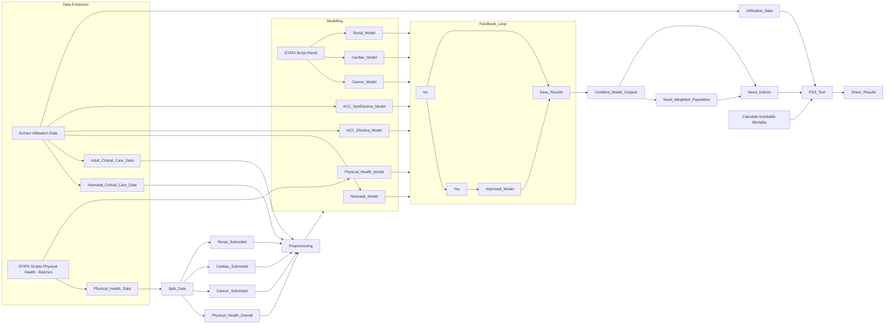

# PSS_Allocations

# Flow chart / graph for Variations Tool data sources
This flowchart describes the totality of data sources and modelling that are dependencies for the Variations Tool as it currently stands.

## Data Sources
- PLCM:
  - PLD
  - Drugs
  - Devices
- CCMDS

# Notes on the Modelling Procedure
