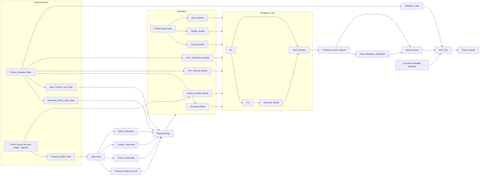

# Welcome to the PSS Allocations repo
Here, you will find a collection of source code and files that are useful for colleagues continuing the analytical work involved in the PSS Physical Health Modelling work and the resultant Variations Tool.

# Handover
Due to the timescales associated with the NHSE reorganisation, this document had been prepared to enable as smooth a handover as possible to enable business continuity and effective knowledge management with respect to the PSS Physical Health Variations Tool.

The Variations Tool is a complicated document, bringing together several separate programmes of modelling work and presenting the results with a fair amount of additional analysis. It has been through quite a few iterations (currently v14) and has the added complexity of requiring three different kinds of updates in the near future (during Q1, 2024-25).
In this document, I outline pre-New-NHSE roles and responsibilities – with named owners where possible – and provide information on how the model is constructed up to the point of handover. Some imminent changes will be required, and to the extent that I can I have provided guidance on next steps. 

The author of this document can happy to be contacted following transition to the new role.

| Name           | Role          | Contact      | Comment      |
| -------------  | ------------- | ------------ | ------------- |
| Ashley Dickson | Head of Payment Development, CFO | Ashley.Dickson@nhs.net | Previously, Senior Analytical Lead, PSS. Outgoing analytical lead.      |
| Donald Franklin | New Role tbc | Donald.Franklin@nhs.net | Formerly, Senior Responsible Owner of product |
| Sam Leat | Analytical Office | samuel.leat@nhs.net| Incoming Analyst |
| Ioannis Andreadis | Senior Analyst | ioannis.andreadis@nhs.net | Incoming Analytical Lead |
| Heather Ross | Senior Analytical Lead | heather.ross1@nhs.net | Incoming SRO |

It is understood at this stage that Sam and Ioannis will be taking over the operational dat-to-day management of the tool and its dissemination.

# Flow chart / graph for Variations Tool data sources
This flowchart describes the totality of data sources and modelling that are dependencies for the Variations Tool as it currently stands. It is provided as a very high-level overview of the steps involved from inception to delivery, and will be updated in the coming days to ensure that steps and repo files are named and numbered in accordance with one another.

# Purpose and Audience
This work (at the time of publication) has three primary purposes, described below. These are the success criteria against which to assess the outputs. It Should be noted that there are several things which this modelling work is not intended to be (and hence is not a measure of its success), namely, it is not intended as a model of Provider or Site resource allocation, neither descriptively or normatively. This is a separate piece of work that regional and ICB colleagues will need to undertake using local intelligence, geography, transportation links, etc., in order to design the most appropriate way of organisation a population-based allocation of resources.

The positive purpose of the Tool is to make clear the way in which a particular ICB deviates from its comparators when considering its overall distance from target such that system and regional colleagues can make evidence-based decisions on what investigations to prosecutre next, and what actions, if any, are to be taken regarding commissioning of services.

# Data Sources
The majority of the activity and spend data for both modelling and DtM analysis come from PLCM and CCMDS. 

PLCM consists of the PLD, Drugs and Devices tables, while CCMDS is cut by ACC and NCC respectively. 

Directions to these tables are:

- PLCM:
  - PLD: [NHSE_Reporting_Regional].[dbo].[vw_DS_Snap_PLD]
  - Drugs: [NHSE_Reporting_Regional].[dbo].[vw_DS_Snap_Drugs]
  - Devices:[NHSE_Reporting_Regional].[dbo].[vw_DS_Snap_Devices]
- CCMDS: [NHSE_SUSPlus_Live].[dbo].[tbl_Data_PbR_CC]

It should be noted that these tables are the preferred tables to use for PLCM; we previously used the relevant [DWS_SLAM].[DWS_Reg].[tbl_Data_*] tables, and these are referred to the in 'PLCM_Query' script given in the repo. This will need updating.

A collection of semi-raw data has been curated and dropped onto the data warehouse for colleagues to interact with programmatically, if they prefer. The locations are given below.
- [NHSE_Sandbox_DC].[dbo].[varTool_ACC_Activity_Model$]
- [NHSE_Sandbox_DC].[dbo].[varTool_Benchmark_Peers$]
- [NHSE_Sandbox_DC].[dbo].[varTool_Model_Need_Indices$]
- [NHSE_Sandbox_DC].[dbo].[varTool_NCC_Activity_Model$]
- [NHSE_Sandbox_DC].[dbo].[varTool_Spend_Model$]

# Data Quality Issues
- To do
  - Next
  - And then
$$
360\degree = 2\pi radians
$$

$$
A=\begin{bmatrix}1&2&3\cr4&5&6\cr7&8&9\end{bmatrix}
$$

# Methodology

The Variations Tool describes the results and of the physical health PSS need modelling work that has been carried out over the last few years. There are many additional analyses that have been layered on top of this original modelling work, which focus largely on understanding the pattern of ICBs ‘distance from target’. There is a fair bit of nuance to this (discussed below), but in broad strokes this means the difference between an ICB’s actual resource use and their modelled resource use. In most cases, ‘resource use’ refers to PSS spend.
The Variations Tool then analyses the distance between actual and modelled spend in terms of two further analyses: (1) access rates, and (2) intensity of care. ‘Access rate’ in this context refers to the proportion of the population who are seen by the relevant clinical service; it is a ratio of a count of heads (rather than of clinical activity) to the size of the population. Clinical activity and its relative costliness is then accounted for by (2) intensity of care. This is also a ratio – of PSS spend in the salient way to the count of patients in (1).
Taken together, this amounts to a system of calculations that can be unified into a single equation:

$$ 
    \frac{Spend}{Population} = 
    \frac{Spend}{Patients} \times \frac{Patients}{Population}
$$

The right hand side of the equation yields the left hand side when we notice that ‘Patients’ cancel out in the algebra. By taking patient count as the basis for both access rates and spend-intensity, we put actual people at the heart of this analysis and reveal some import insights. This is plotted in the Tool in several places as a ‘mountain plot’ (see tab 2. ACCESS AND SPEND COMPARISONS). The upshot is that ICBs are able to see not only their own distance from target, but also their distance in 3-dimensional space from their benchmark group. (The 3 dimensions in question are access rate, intensity, and resource use per head of population).

# Additional Considerations
-	Notes for: 
    - NCC
    - ACC
-	Undiagnosed mortality:
    - Cancer
    - Cardiac
-	Transition to Model System
    - Contact and email

# VBA Code in Benchmarking Tool
There is code behind the following worksheets: -
- Notes:        
  + Code to hide and unhide the backing sheets
- ICB input:    
  + Code to clear user-defined benchmark group
  + Code to select all other ICBs in the same region
  + Clear user-defined sections of other worksheets when no selection made
  + Clear user-defined group when selected ICB is changed
- Benchmark groups
  + Code to hide/unhide the different benchmark groups linked to buttons on chart
- Summary
    + Code linked to sheet buttons to hide/unhide rows with additional information
- Spend per head population
    + Code that is triggered when bars in the chart are clicked on (and then unhides the details sheet)
    + Code linked to the orange button to unhide the additional detail chart
- Spend per head chart 1; Spend per head chart 2; Spend per head chart 3; and Spend per head chart 4
    + All have code to hide tab and return to spend per head population tab when mouse clicks anywhere on page
    + Spend per patient
    + Code that is triggered when bars in the chart are clicked on (and then unhides the details sheet)
- Spend per patient detail
    + Code to hide tab and return to spend per patient tab when mouse clicks anywhere on page
    + Code for each of the checkboxes to include/exclude the averages bars
- Patients per head
    + Code that is triggered when bars in the chart are clicked on (and then unhides the details sheet)
- Patients per head detail
    + Code to hide tab and return to patients per head tab when mouse clicks anywhere on page
    + Code for each of the checkboxes to include/exclude the averages bars
- Spending & Access
    + Code to show info when point is clicked on
- Comparison with core allocation
    + Code to highlight selected ICB row and benchmark ICB rows
- HIV, NCC, Cancer, Cardiac, Renal: spending & access
    + Code to show HIV info when point is clicked on

There is also a lot of code linked to various buttons and click throughs in “Module 1” which can be found through the VBA editor.

Note that the option buttons on the spending and access tabs do not link to VBA macros, they are linked to cell values in the corresponding calculation sheets.
